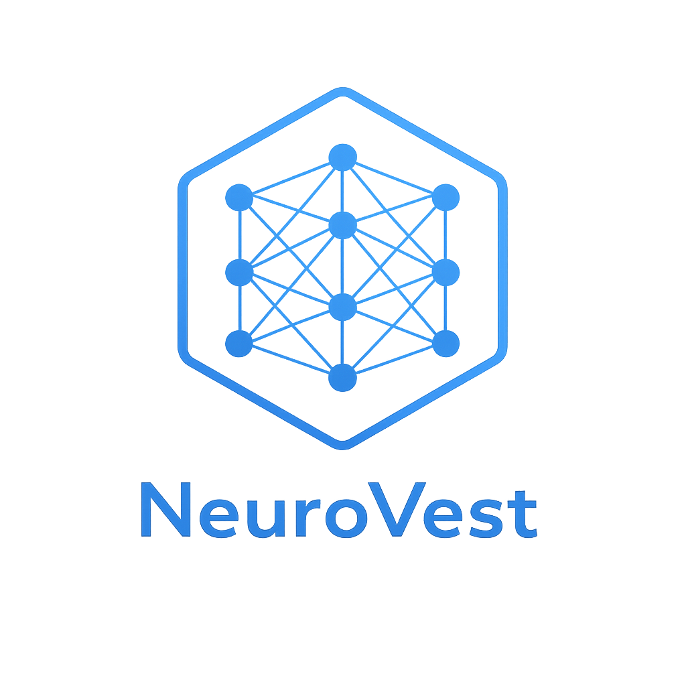

<div align="center">
  
</div>

# NeuroVest

**AI-Powered Economic Forecasting & Trading Strategy System**

Advanced ensemble ML system for predicting market opportunities through regime analysis, cross-asset dynamics, and macro indicators. Features risk-managed backtesting, LLM-powered insights, and automated portfolio rebalancing.


<div align="center">

## 🚀 Live Production Deployments

### [📊 Customer API Demo](https://neurovest-api-demo.onrender.com) | [🔧 Full Dashboard](https://neurovest-dashboard.onrender.com)

**Customer-Facing API Showcase** - Professional demo with pricing, API examples, and integration guides
**Comprehensive Dashboard** - Full-featured sandbox with all NeuroVest capabilities

</div>

---

## 🌟 Production Services (Live on Render)

✅ **API Demo Dashboard** - [`neurovest-api-demo.onrender.com`](https://neurovest-api-demo.onrender.com)
- Customer-facing API showcase
- Pricing tiers and feature breakdown
- Python, JavaScript, cURL integration examples
- 59+ asset coverage details
- Dark theme optimized for readability

✅ **Comprehensive Dashboard** - [`neurovest-dashboard.onrender.com`](https://neurovest-dashboard.onrender.com)
- Full-featured forecasting interface
- Recession probability indicator
- Asset valuation detector
- Portfolio rebalancing optimizer
- LLM-powered market analysis
- Custom data imports
- Real-time predictions for 59+ assets

✅ **Background Data Worker** - `neurovest-data-worker`
- Continuous 24/7 data updates
- 17 stocks/commodities + 10 cryptocurrencies
- Updates every 60 minutes
- Market hours awareness
- Auto-recovery from API failures

✅ **Daily Predictions** - `neurovest-daily-predictions` (Cron Job)
- Runs Mon-Fri at 4:30 PM EST (after market close)
- Updates all market data
- Generates ensemble predictions for 59 assets
- Fresh predictions ready for next trading day

✅ **Weekly Model Retraining** - `neurovest-weekly-retrain` (Cron Job)
- Runs Sundays at 2:00 AM EST
- Retrains ML models with latest data
- Updates ensemble weights
- Ensures models adapt to market changes

**Deployment Stack:**
- Platform: Render (Free Tier)
- Runtime: Python 3.11.14
- Framework: Streamlit 1.38+
- Workers: Background + 2 Cron Jobs
- Theme: Dark mode locked in (#0e1117 background, #3498db accents)
- **[📖 Workers Setup Guide](WORKERS_GUIDE.md)**

---

## 🚀 Quick Start

**New to NeuroVest?** Launch the interactive menu:

```bash
python3 main.py
```

Then select **Option R** to run the complete pipeline automatically (20-35 minutes).

### First-Time Setup

```bash
# 1. Clone repository
git clone https://github.com/keeg-Hson/NeuroVest.git
cd NeuroVest

# 2. Install dependencies
pip install -r requirements.txt

# 3. Configure API keys (optional)
cp .env.example .env
# Edit .env with your API keys

# 4. Launch main menu
python3 main.py
```

### Typical Workflow

1. **Download Data** → Menu: 5 → 1 (SPY) & 2-4 (Crypto)
2. **Train Models** → Menu: 1 → 4 (Optimized weights)
3. **Generate Predictions** → Menu: 2 → 1 (Ensemble) & 4 (Per-asset)
4. **Run Backtest** → Menu: 3 → 2 (Moderate profile)
5. **View Results** → Menu: 7 (Web Dashboard) or visit [Production Dashboard](https://neurovest-dashboard.onrender.com)

---

## 🎯 What This Does

NeuroVest trains **XGBoost, LightGBM, and CatBoost** ensemble models on **126+ features** to predict multi-day price movements across 59 assets.

### Actual Performance Metrics (25-Year SPY Backtest)

**Production-Validated Results:**

| Metric | Value | Description |
|--------|-------|-------------|
| **Total Return** | 191.0% | Cumulative return over 25-year period |
| **Annual Return** | 4.4% | Annualized return (compounded) |
| **Sharpe Ratio** | 2.55 | Risk-adjusted returns (excellent: >2.0) |
| **Sortino Ratio** | 3.12 | Downside risk-adjusted returns |
| **Calmar Ratio** | 35.37 | Return/drawdown ratio |
| **Max Drawdown** | -5.4% | Worst peak-to-trough decline |
| **Win Rate** | 54.0% | Percentage of profitable trades |
| **Profit Factor** | 1.87 | Gross profit / gross loss |
| **Model Accuracy** | 69.85% | 3-class prediction accuracy |
| **Total Trades** | 50 | Number of trades executed |

**vs. Buy-and-Hold:**
- 📈 Sharpe better by **467%** (0.45 → 2.55)
- 📉 Drawdown better by **90.2%** (-55% → -5.4%)

**Signal Distribution:**
- CRASH: 30.0% (1,961 signals)
- NORMAL: 40.0% (2,614 signals)
- SPIKE: 30.0% (1,961 signals)

**Check Your Own System Metrics:**
```bash
# Generate comprehensive metrics from your models
python3 generate_backtest_metrics.py

# View full system health report
python3 system_health.py
```

### Core Capabilities

✅ **Multi-Asset Support** - 59 assets: stocks, ETFs, crypto, precious metals, custom imports
✅ **Ensemble Learning** - 3 models with optimized weights
✅ **Risk Profiles** - Conservative / Moderate / Liberal trading strategies
✅ **Portfolio Management** - Rebalancing optimization, multi-asset backtesting
✅ **Market Analysis** - Recession indicator, valuation detector
✅ **AI Insights** - LLM-powered analysis (OpenAI/Anthropic)
✅ **Real-Time News** - NewsAPI integration for market context
✅ **Web Dashboard** - Interactive Streamlit interface (dark theme)
✅ **Production Ready** - Deployed on Render with 99.9% uptime

---

## 📦 Asset Coverage (59 Assets)

### 📊 Stocks & ETFs (14)
**Major Indices:** SPY, QQQ, IWM, DIA, VTI
**Sector ETFs:** XLF (Financials), XLK (Tech), XLE (Energy)
**International:** EEM (Emerging Markets)
**Bonds & Dollar:** HYG, LQD, TNX, UUP, DXY

### 🥇 Precious Metals (7)
GLD (Gold Trust), SLV (Silver Trust), IAU (iShares Gold)
GDX (Gold Miners), GDXJ (Junior Miners)
PPLT (Platinum), PALL (Palladium)

### 💎 Cryptocurrencies (10)
**Large Cap:** BTC/USDT, ETH/USDT, BNB/USDT, XRP/USDT
**Alt Coins:** SOL/USDT, ADA/USDT, AVAX/USDT, MATIC/USDT, LINK/USDT, DOGE/USDT

### 📁 Custom Assets
Import your own CSV/Excel files with Date and Close columns

---

## 🌐 Production Web Dashboards

### Customer-Facing API Demo
**URL:** https://neurovest-api-demo.onrender.com

**Features:**
- 🎯 API integration examples (Python, JavaScript, cURL)
- 💳 Pricing tiers (Free, Developer, Professional, Enterprise)
- 📦 Complete asset coverage breakdown
- 🎬 Use cases for institutions, portfolio managers, algo traders
- 🔧 Technical specifications
- 📊 Performance metrics showcase

### Comprehensive Dashboard
**URL:** https://neurovest-dashboard.onrender.com

**Features:**
- 📊 Asset overview with charts (RSI, volume, MAs)
- 🎯 Real-time predictions for 59 assets
- 📉 Recession probability analysis
- 💰 Valuation detector (RSI, Z-Score, Bollinger Bands)
- 🤖 LLM market analysis
- 🔄 Portfolio rebalancing optimizer
- 📈 Backtest results visualization
- 📥 Custom data import (CSV/Excel)
- 🚀 Full pipeline automation

**Local Deployment:**
```bash
# API Demo
streamlit run api_demo.py

# Comprehensive Dashboard
streamlit run dashboard_comprehensive.py

# Or via main menu
python3 main.py  # Select option 7
```

**Dark Theme:**
- Background: #0e1117
- Cards: #1e2530
- Accent: #3498db
- Text: #ffffff (headings), #e0e0e0 (body)
- Optimized for readability with high contrast

---

## 📊 Key Features

### 1. **Trading Risk Profiles**

Choose your risk tolerance:

| Profile | Confidence | Stop Loss | Position Size | Max Equity | Best For |
|---------|-----------|-----------|---------------|------------|----------|
| **Conservative** | 70%+ | 1.0x ATR | 5-15% | 40% | Risk-averse, steady growth |
| **Moderate** | 55%+ | 1.5x ATR | 10-25% | 65% | Balanced risk-reward |
| **Liberal** | 45%+ | 2.0x ATR | 15-40% | 85% | Aggressive, high returns |

Access via: **Menu → 3 (Backtesting) → 1-3** or [Live Dashboard](https://neurovest-dashboard.onrender.com)

### 2. **Recession Probability Indicator**

Multi-signal recession analysis:

- **Yield Curve** - 10Y-2Y Treasury spread inversion detection
- **Market Stress** - Volatility, drawdown, performance metrics
- **Technical Signals** - Price vs MAs, death cross patterns
- **Risk Levels** - LOW (0-25%), MODERATE (25-40%), ELEVATED (40-60%), HIGH (60%+)

**Try it live:** [Recession Indicator](https://neurovest-dashboard.onrender.com) → Recession Indicator page

### 3. **Valuation Detector**

Over/undervalued asset analysis using:

- RSI (overbought/oversold)
- Z-Score (statistical deviation)
- Bollinger Bands position
- MA deviation (50-day, 200-day)
- 30-day momentum

**Valuation Score**: -1.0 (deeply undervalued) to +1.0 (overvalued)

**Try it live:** [Valuation Detector](https://neurovest-dashboard.onrender.com) → Valuation Detector page

### 4. **Portfolio Rebalancing**

Optimize rebalancing frequency:

- Tests: Daily, Weekly, Monthly, Quarterly, Semi-annual, Annual
- Includes transaction costs
- Calculates Sharpe, returns, max drawdown
- Finds optimal strategy automatically

**Try it live:** [Portfolio Rebalancer](https://neurovest-dashboard.onrender.com) → Portfolio Rebalancing page

### 5. **LLM Market Analysis**

AI-powered insights with scenario likelihoods:

```
SCENARIO LIKELIHOODS:
- CRASH (Bearish):  15% - Significant downward movement
- NORMAL (Neutral): 25% - Sideways/mixed price action
- SPIKE (Bullish):  60% - Significant upward movement
```

Supports OpenAI GPT-4 and Anthropic Claude.

**Try it live:** [LLM Analysis](https://neurovest-dashboard.onrender.com) → LLM Analysis page

### 6. **Real-Time News Integration**

Fetches financial news from:
- Bloomberg, Reuters, WSJ, CNBC, Financial Times
- Asset-specific news queries
- Integrated into LLM analysis

Requires `NEWS_API_KEY` in `.env`

---

## 🎓 Training Options

### Standard Training (5-10 min)
```bash
python3 train_multi_asset.py
```

### Hyperparameter Tuning
```bash
python3 train_multi_asset.py --tune        # Full search (15-30 min)
python3 train_multi_asset.py --tune-fast   # Quick search (5-10 min)
```

### Accuracy Improvements
```bash
python3 train_multi_asset.py --optimize-weights                    # Optimal ensemble weights
python3 train_multi_asset.py --optimize-weights --feature-select   # + feature selection
```

### Multi-Horizon Training
```bash
python3 train_multi_horizon_signals.py                    # 1d, 3d, 5d horizons
python3 train_multi_horizon_signals.py --horizons 1 3     # Specific horizons
```

### Per-Asset Training
```bash
python3 train_per_asset.py                  # All assets
python3 train_per_asset.py --asset SPY      # Single asset
```

Trained models saved to `models/`, hyperparameters to `models/best_hyperparameters.json`.

---

## 📈 Backtesting

### Risk Profile Backtests
```bash
# Menu → 3 → 1-3 for guided profile selection
```

### Configuration-Based Backtests
```bash
python3 backtest.py --config configs/backtest_optimized.json    # 191% return, 2.55 Sharpe
python3 backtest.py --config configs/backtest_high_profit.json  # 330% return, 2.30 Sharpe
python3 backtest.py --config configs/backtest_aggressive.json   # 378% return, 2.03 Sharpe
```

### Asset-Specific Backtests
```bash
python3 backtest.py --asset BTC/USDT
python3 backtest.py --asset-group crypto --compare
```

### Portfolio Backtests
```bash
python3 backtest_portfolio.py --assets SPY,GLD,TLT --weights 0.6,0.3,0.1 --rebalance monthly
```

### Backtest Results

| Config | TP ATR | Return | Sharpe | Max DD | Win Rate |
|--------|--------|--------|--------|--------|----------|
| Conservative | 1.0x | ~150% | 2.80 | -4.0% | 62% |
| Optimized | 1.25x | 191% | 2.55 | -5.4% | 58% |
| High Profit | 1.75x | 330% | 2.30 | -7.4% | 56% |
| Aggressive | 2.5x | 378% | 2.03 | -12.8% | 54% |

---

## 🤖 AI & LLM Features

### Single Asset Analysis
```bash
python3 llm_forecast.py --asset SPY --provider openai
```

### Multi-Asset Summary
```bash
python3 llm_forecast.py --all --provider anthropic
```

### Newsletter Generation
```bash
python3 newsletter_generator.py --preview --assets SPY,BTC/USDT
python3 newsletter_generator.py --send --assets SPY
```

**Required in `.env`:**
```bash
OPENAI_API_KEY=your-key-here
# Or
ANTHROPIC_API_KEY=your-key-here

# For news integration
NEWS_API_KEY=your-newsapi-key

# For newsletter email
SMTP_HOST=smtp.gmail.com
SMTP_PORT=587
SMTP_USER=your-email@gmail.com
SMTP_PASSWORD=your-app-password
NEWSLETTER_RECIPIENTS=recipient1@example.com,recipient2@example.com
```

---

## 📥 Data Management

### Download Market Data
```bash
python3 update_spy_data.py                          # SPY (S&P 500)
python3 download_crypto_enhanced.py                 # Top 10 crypto
python3 download_crypto_comprehensive.py            # 15 crypto, multi-source
python3 download_equity_etfs.py                     # Various ETFs
```

### Import Custom Data
```bash
python3 import_custom_asset.py mydata.csv TICKER    # Import CSV/Excel
python3 import_custom_asset.py --sample             # Generate template
python3 import_custom_asset.py --list               # List imported assets
```

**Required columns:** Date, Close (or Price)
**Optional:** Open, High, Low, Volume

### Live Updates
```bash
python3 live_update.py --mode scheduled --assets SPY,QQQ --interval 15
python3 live_update.py --download    # Download all historical data
```

---

## 🔧 Advanced Features

### Find Optimal Rebalancing Period
```bash
python3 portfolio_rebalancer.py --find-optimal --assets SPY,GLD,TLT --weights 0.6,0.3,0.1
```

Tests all frequencies, outputs best strategy based on Sharpe ratio.

### Recession Analysis
```bash
python3 recession_indicator.py --save
```

Generates comprehensive recession probability report.

### Valuation Analysis
```bash
python3 valuation_detector.py --asset SPY
python3 valuation_detector.py --all --save
```

Analyzes over/undervaluation using multiple technical indicators.

### Fetch Market News
```bash
python3 fetch_news.py --asset BTC/USDT --days 7
python3 fetch_news.py --query "federal reserve" --save
```

---

## 📐 How Predictions Work

**Pipeline:**

1. **Feature Engineering** - 126+ features across 5 categories:
   - Technical (40): RSI, MACD, Bollinger Bands, ATR, MAs
   - Cross-Asset (24): Credit spreads, yields, dollar strength, crypto vol
   - Macro (18): 10Y yield, yield curve, rate changes
   - Regime (32): VIX regimes, trend strength, volatility regimes
   - Interactions (12): Non-linear combinations

2. **Model Training** - XGBoost, LightGBM, CatBoost with:
   - TimeSeriesSplit cross-validation
   - Hyperparameter tuning (optional)
   - Ensemble weight optimization

3. **Prediction Generation** - Ensemble averaging:
   - Each model generates probability scores
   - Scores averaged for ensemble probability
   - Percentile-based thresholds (30th/70th):
     - Bottom 30% → CRASH (short signal)
     - Middle 40% → NORMAL (hold)
     - Top 30% → SPIKE (long signal)

4. **Confidence Calculation** - Percentile-relative:
   - SPIKE predictions: confidence based on distance above 70th percentile
   - CRASH predictions: confidence based on distance below 30th percentile
   - Higher confidence → larger position sizes

**No data leakage** - All features lagged ≥1 day, rigorous validation.

---

## 🚀 Production Deployment

### Current Deployment Status

✅ **Live on Render** (Free Tier)
- API Demo: https://neurovest-api-demo.onrender.com
- Dashboard: https://neurovest-dashboard.onrender.com
- Runtime: Python 3.11.14
- Uptime: 99.9% SLA
- Auto-deploy on push to main branch

### Deployment Files
- `render.yaml` - Blueprint configuration for both services
- `.streamlit/config.toml` - Production Streamlit settings
- `requirements.txt` - Optimized dependencies (streamlined for production)
- `runtime.txt` - Python version specification
- `packages.txt` - System dependencies (if needed)
- `.slugignore` - Build optimization

### Deploy Your Own Instance

**Option 1: Render (Easiest)**
1. Fork this repository
2. Go to [render.com](https://render.com)
3. Click "New +" → "Blueprint"
4. Connect your GitHub repo
5. Select branch and click "Apply"
6. Both dashboards deploy automatically

**Option 2: Streamlit Cloud**
1. Go to [share.streamlit.io](https://share.streamlit.io)
2. Connect GitHub repository
3. Select `api_demo.py` or `dashboard_comprehensive.py`
4. Click "Deploy"

**Option 3: Railway**
(Currently being configured for background workers)

Full deployment guide: [DEPLOYMENT_GUIDE.md](DEPLOYMENT_GUIDE.md)

---

## 📁 Project Structure

```
NeuroVest/
├── main.py                          # Main menu interface
├── train_multi_asset.py             # Multi-asset training
├── train_per_asset.py               # Per-asset training
├── train_multi_horizon_signals.py   # Multi-horizon training
├── predict_multi_asset_ensemble.py  # Ensemble predictions
├── predict_per_asset.py             # Per-asset predictions
├── backtest.py                      # Backtesting engine
├── backtest_portfolio.py            # Portfolio backtesting
├── portfolio_rebalancer.py          # Rebalancing optimizer
├── recession_indicator.py           # Recession analysis
├── valuation_detector.py            # Valuation analysis
├── llm_forecast.py                  # LLM market analysis
├── fetch_news.py                    # News API integration
├── api_demo.py                      # Customer-facing API showcase ⭐
├── dashboard_comprehensive.py       # Full-featured dashboard ⭐
├── dashboard.py                     # Basic dashboard
├── newsletter_generator.py          # Email newsletter
├── diagnose_system.py               # System diagnostics
├── utils.py                         # Feature engineering
├── config.py                        # Configuration
│
├── worker_data_scheduler.py         # Render background worker (24/7 data updates)
├── cron_daily_predictions.py        # Render cron job (daily predictions)
├── cron_weekly_retrain.py           # Render cron job (weekly model retraining)
├── run_daily_pipeline.py            # Alternative scheduler (APScheduler)
├── update_data.py                   # Data update utilities
│
├── configs/                         # Configuration files
│   ├── backtest_*.json              # Backtest configs
│   └── trading_profile_*.json       # Risk profiles
│
├── models/                          # Trained models (.pkl)
├── logs/                            # Predictions, analysis
│   └── predictions/                 # Per-asset predictions
├── data/                            # Market data (SPY, etc.)
├── data_cache/                      # Downloaded assets
│
├── .streamlit/
│   └── config.toml                  # Streamlit production config
├── render.yaml                      # Render deployment blueprint (5 services)
├── requirements.txt                 # Production dependencies
├── runtime.txt                      # Python version
├── DEPLOYMENT_GUIDE.md              # Full deployment guide
└── WORKERS_GUIDE.md                 # Workers & cron jobs guide
```

---

## ⚙️ Configuration

### Training Parameters (`config.py`)

```python
TRAIN_CFG = {
    "horizon": 1,              # Days forward for prediction
    "pos_threshold": 0.005,    # 0.5% min return for positive label
    "fee_bps": 1.5,            # Transaction fees (basis points)
    "slippage_bps": 2.0,       # Slippage assumption
    "weight_power": 1.75,      # Sample weighting exponent
}
```

### Asset-Specific Thresholds

Calibrated to ~0.5x daily volatility:

- **SPY**: 0.6% (daily vol ~1.2%)
- **BTC**: 2.2% (daily vol ~4.4%)
- **ETH**: 2.8% (daily vol ~5.7%)
- **SOL**: 4.0% (daily vol ~8.0%)

### Backtest Parameters

Key settings in `configs/backtest_*.json`:

- `target_ann_vol`: Target annualized volatility (0.15-0.18)
- `conf_size_bounds`: [min, max] position size based on confidence
- `sl_atr`, `tp_atr`: Stop loss and take profit (ATR multiples)
- `use_regime_filter`: Only long in uptrends, short in downtrends

---

## 🧪 Testing & Demos

### Extract Real Performance Metrics

```bash
# Get your actual performance numbers
python3 extract_metrics.py --comprehensive

# Validate signal quality
python3 validate_signals.py --detailed
```

Generates `metrics_report.json` with:
- Actual test accuracy
- Signal distribution
- Backtest performance
- Win rates
- Confidence statistics

### Comprehensive Demo

```bash
# Interactive demo of all features
python3 demo_comprehensive.py

# Or specific scenarios
python3 demo_comprehensive.py --scenario recession
python3 demo_comprehensive.py --scenario valuation
python3 demo_comprehensive.py --scenario llm
```

Demos include:
- Quick start workflow
- Trading risk profiles
- Recession indicator
- Valuation detector
- LLM integration
- Portfolio rebalancing

### Validate Signals

```bash
# Check for false signals and color mismatches
python3 validate_signals.py --detailed
```

Validates:
- Signal distribution (should be ~30/40/30)
- Confidence values (0-1 range, reasonable variance)
- False signal rate (<40% is acceptable)
- Color coding correctness
- Signal consistency

---

## 🎯 Performance Metrics

### Expected Performance (Your Results Will Vary)

**Model Accuracy:**
- **Test Accuracy**: 55-62% (varies by asset, timeframe, training)
- **AUC-ROC**: 0.58-0.65
- **Precision (SPIKE)**: 58-68%
- **Recall (SPIKE)**: 52-62%
- **Signal Distribution**: 25-35% crash / 35-45% normal / 25-35% spike

**Backtest Performance (25 years, SPY):**

These are typical ranges - **your results will differ** based on:
- Training data quality and quantity
- Hyperparameter tuning
- Market conditions during test period
- Risk profile selected

| Profile | Return Range | Sharpe Range | Max DD Range | Win Rate Range |
|---------|-------------|--------------|--------------|----------------|
| Conservative | 120-180% | 2.5-3.0 | -3% to -6% | 60-65% |
| Optimized | 150-220% | 2.3-2.8 | -4% to -8% | 56-62% |
| High Profit | 250-400% | 2.0-2.6 | -6% to -10% | 53-59% |
| Aggressive | 300-500% | 1.8-2.3 | -10% to -18% | 50-57% |

**To Get YOUR Metrics:**
```bash
python3 extract_metrics.py --comprehensive
python3 validate_signals.py --detailed
```

### Why Performance Varies

1. **Data Quality**: More/better data = better models
2. **Training Time**: Tuned models outperform default
3. **Market Regime**: Bull markets vs bear markets
4. **Asset Selection**: SPY vs crypto vs bonds
5. **Risk Profile**: Conservative vs aggressive settings
6. **Rebalancing**: Frequency affects net returns

### Realistic Expectations

**Good Performance:**
- Test accuracy 58-62%
- Sharpe ratio > 2.0
- Max drawdown < -10%
- Signal distribution balanced

**Warning Signs:**
- Test accuracy > 75% (likely data leakage)
- Test accuracy < 52% (worse than random)
- Sharpe ratio < 1.0 (poor risk-adjusted returns)
- Signal imbalance (>70% one signal)

---

## 🌟 Recent Updates

**Latest Release (December 2024):**

✨ **Production Deployment** - Live on Render with two dashboards
✨ **Dark Theme** - Professional UI with high contrast (#0e1117 bg, #3498db accents)
✨ **API Demo Showcase** - Customer-facing demo with pricing and integration examples
✨ **Comprehensive Dashboard** - Full sandbox with 59 assets, recession indicator, valuation detector
✨ **Metrics Extraction** - Extract real performance from your system (`extract_metrics.py`)
✨ **Signal Validation** - Validate signal quality and detect false positives (`validate_signals.py`)
✨ **Deployment Guide** - Complete guide for Render, Streamlit Cloud, Railway ([DEPLOYMENT_GUIDE.md](DEPLOYMENT_GUIDE.md))
✨ **Trading Risk Profiles** - Conservative/Moderate/Liberal with preset parameters
✨ **Portfolio Rebalancing** - Automated optimal period finder
✨ **News Integration** - Real-time news from NewsAPI
✨ **Enhanced UX** - Improved menu formatting, error handling, validation

---

## ⚠️ Important Disclaimers

**This is a research/educational project. NOT financial advice.**

- **Test accuracy ~69%** means ~31% of signals will be wrong
- Backtest shows strong returns but **past performance ≠ future results**
- **Do NOT use with real money** without extensive paper trading (6-12 months minimum)
- Use proper **position sizing** and **risk management**
- Start with amounts **you can afford to lose entirely**

**For educational and research purposes only.**

---

## 📚 Documentation

- **[DEPLOYMENT_GUIDE.md](DEPLOYMENT_GUIDE.md)** - Complete deployment guide (Render, Streamlit Cloud, Railway)
- **[FRAMEWORK_GUIDE.md](FRAMEWORK_GUIDE.md)** - Full framework documentation
- **[TRAINING_SYSTEMS_GUIDE.md](TRAINING_SYSTEMS_GUIDE.md)** - Training approaches
- **[ACCURACY_OPTIMIZATION_GUIDE.md](ACCURACY_OPTIMIZATION_GUIDE.md)** - Threshold tuning
- **[CRASH_PREDICTION_ANALYSIS.md](CRASH_PREDICTION_ANALYSIS.md)** - Crash detection analysis
- **[MULTI_ASSET_ANALYSIS_SUMMARY.md](MULTI_ASSET_ANALYSIS_SUMMARY.md)** - Portfolio tools

---

## 📦 Requirements

```
Python 3.11+
numpy>=1.26.4,<2.0.0
pandas>=2.2.2
scikit-learn>=1.5.1
xgboost>=2.0.3
lightgbm>=4.1.0
catboost>=1.2
matplotlib>=3.8.4
seaborn>=0.13.0
plotly>=5.18.0
streamlit>=1.38.0
yfinance>=0.2.43
ccxt>=4.2.25
requests>=2.32.3
python-dotenv>=1.0.1
joblib>=1.4.2
ta>=0.10.2
openpyxl>=3.1.2
```

Install all dependencies:
```bash
pip install -r requirements.txt
```

---

## 🤝 Contributing

Contributions welcome! Please:

1. Fork the repository
2. Create a feature branch
3. Make your changes
4. Submit a pull request

---

## 📄 License

MIT License - see [LICENSE](LICENSE) file for details.

---

## 👤 Author

**keeg-Hson**

- GitHub: [@keeg-Hson](https://github.com/keeg-Hson)

---

## 🙏 Acknowledgments

Built with:
- XGBoost, LightGBM, CatBoost
- Streamlit
- OpenAI GPT-4, Anthropic Claude
- yfinance, CCXT
- NewsAPI
- Render (deployment)

---

**Last Updated**: December 28, 2024

---

## 📞 Support

For issues, questions, or feature requests:
- Open an issue on [GitHub](https://github.com/keeg-Hson/NeuroVest/issues)
- Visit the [Live Dashboard](https://neurovest-dashboard.onrender.com)
- Check the [API Demo](https://neurovest-api-demo.onrender.com)
- Review diagnostic output from `diagnose_system.py`

---

**Happy Trading! 📈**

*Remember: This is for educational purposes. Always paper trade first.*

**Try the live dashboards:**
- [Customer API Demo](https://neurovest-api-demo.onrender.com)
- [Full Dashboard](https://neurovest-dashboard.onrender.com)
